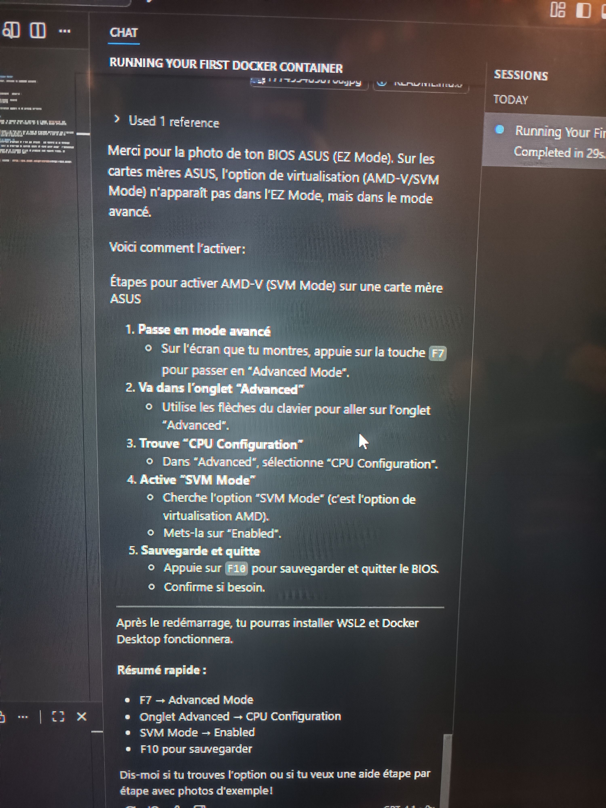
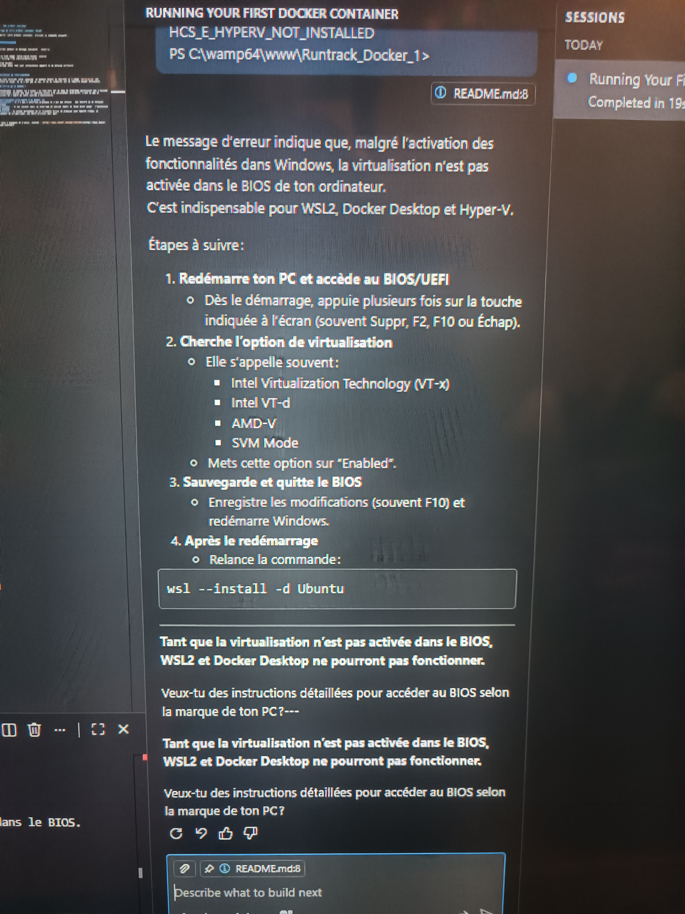
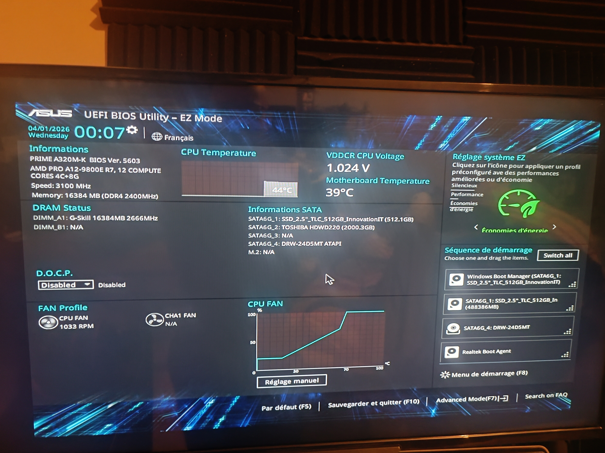

# Projet 04 - Jouer en émulation avec une image de Super Mario

## Objectif
Mettre en pratique les notions Docker : chercher, récupérer, lancer, utiliser et arrêter une image Super Mario. Montrer les deux méthodes (terminal et Docker Desktop).

---

## 1) Chercher l'image Super Mario

### Via Terminal
```bash
docker search mario
```

**Résultat :**
```
NAME                     DESCRIPTION                                     STARS   OFFICIAL
kaminskypavel/mario      an image running a Super Mario game...          14
sevenajay/mario          Relive Mario's adventures in this browser ga…   3
appcontainers/mario      Mario!!!!                                       0
...
```

**Image cible :** `sevenajay/mario:latest`

### Via Docker Desktop
- Ouvrir Docker Desktop
- Aller dans le menu gauche → "Images"
- Utiliser la barre de recherche pour chercher "mario"
- Affichage des images disponibles

---

## 2) Récupérer l'image Super Mario

### Via Terminal
```bash
docker pull sevenajay/mario:latest
```

**Résultat :**
```
latest: Pulling from sevenajay/mario
...
Digest: sha256:8541a39162f3510821eccb7be96a12ba210e93cefee55e7d3fb159418019116b
Status: Image is up to date for sevenajay/mario:latest
```

### Via Docker Desktop
- Aller dans "Images"
- Cliquer sur l'image "sevenajay/mario"
- Cliquer sur le bouton "Pull"
- Attendre que l'image soit téléchargée

---

## 3) Lancer un conteneur Super Mario

### Méthode 1 : Via Terminal (Port 8600)
```bash
docker run -d -p 8600:8080 --name mario-game-1 sevenajay/mario:latest
```

**Explications :**
- `-d` : Mode détaché (en arrière-plan)
- `-p 8600:8080` : Mappe le port 8600 de l'hôte vers le port 8080 du conteneur
- `--name mario-game-1` : Nomme le conteneur

**Résultat (ID du conteneur) :**
```
5d5585ea02af905e8fd072cfa7ab4da05673e4855b63580decb5e3aa93d468f4
```

### Méthode 2 : Via Docker Desktop
- Aller dans le menu gauche → "Containers"
- Chercher l'image "sevenajay/mario"
- Cliquer sur le bouton "Run"
- Configurer :
  - Container name : `mario-game-1`
  - Ports : `8600:8080`
- Cliquer sur "Run"

---

## 4) Lancer un second conteneur (Port 8700)

### Via Terminal
```bash
docker run -d -p 8700:8080 --name mario-game-2 sevenajay/mario:latest
```

**Résultat (ID) :**
```
27aae726b97a17ce7b1d3dfa65d1b25ad6165980f933660ea5e6f2378e74e496
```

---

## 5) Vérifier les conteneurs en cours d'exécution

### Via Terminal
```bash
docker ps
```

**Résultat :**
```
CONTAINER ID   IMAGE                      COMMAND              CREATED        STATUS         PORTS
27aae726b97a   sevenajay/mario:latest     "/docker-entrypoint…" 35 seconds     Up 34 seconds   0.0.0.0:8700->8080/tcp   mario-game-2
5d5585ea02af   sevenajay/mario:latest     "/docker-entrypoint…" 43 seconds     Up 41 seconds   0.0.0.0:8600->8080/tcp   mario-game-1
```

### Via Docker Desktop
- Aller dans le menu gauche → "Containers"
- Affichage de tous les conteneurs actifs avec leurs ports et statuts

**Capture Docker Desktop (liste des conteneurs) :**


*Vue Docker Desktop montrant les conteneurs en cours d'exécution et leurs ports mappés.*

---

## 6) Accéder au jeu Super Mario

### Conteneur 1 (Port 8600)
**URL :** http://127.0.0.1:8600 ou http://localhost:8600

### Conteneur 2 (Port 8700)
**URL :** http://127.0.0.1:8700 ou http://localhost:8700

**Captures d'écran du jeu :**


*Partie en cours du jeu Super Mario dans le navigateur.*


*Vue globale : Docker Desktop, terminal PowerShell et applications web en exécution (Mario + Welcome to Docker).*

---

## 7) Arrêter les conteneurs

### Méthode 1 : Via Terminal (par ID)
```bash
docker stop 5d5585ea02af
```

### Méthode 2 : Via Terminal (par nom)
```bash
docker stop mario-game-2
```

**Résultat :**
```
5d5585ea02af
mario-game-2
```

### Via Docker Desktop
- Aller dans "Containers"
- Trouver le conteneur "mario-game-1"
- Cliquer sur le bouton "Stop" (carrée)
- Répéter pour "mario-game-2"

---

## 8) Deux manières de trouver l'ID du conteneur

### Méthode 1 : Commande `docker ps`
```bash
docker ps
```
Affiche la colonne `CONTAINER ID` directement

### Méthode 2 : Commande `docker ps -a` avec grep
```bash
docker ps -a | grep mario-game
```

### Via Docker Desktop
- Aller dans "Containers"
- L'ID est affiché pour chaque conteneur
- Vous pouvez aussi utiliser le nom du conteneur

---

## 9) Supprimer les conteneurs

### Méthode 1 : Via Terminal (par ID et nom)
```bash
docker rm 5d5585ea02af mario-game-2
```

**Résultat :**
```
5d5585ea02af
mario-game-2
```

### Méthode 2 : Supprimer tous les conteneurs arrêtés
```bash
docker container prune
```

### Via Docker Desktop
- Aller dans "Containers"
- Cliquer sur l'icône "trash" à côté du conteneur
- Confirmer la suppression

---

## 10) Supprimer l'image Super Mario

### Méthode 1 : Suppression simple
```bash
docker rmi sevenajay/mario:latest
```

Si l'image est utilisée par un conteneur :
```
Error response from daemon: conflict: unable to delete sevenajay/mario:latest
(must be forced) - container c42347cc061b is using its referenced image
```

### Méthode 2 : Forcer la suppression
```bash
docker rmi -f sevenajay/mario:latest
```

**Résultat :**
```
Untagged: sevenajay/mario:latest
```

### Via Docker Desktop
- Aller dans "Images"
- Cliquer sur l'icône "trash" à côté de l'image
- Confirmer la suppression

---

## Récapitulatif des commandes essentielles

### Chercher une image
```bash
docker search mario
```

### Récupérer une image
```bash
docker pull sevenajay/mario:latest
```

### Lancer un conteneur
```bash
docker run -d -p PORT_HOTE:PORT_CONTENEUR --name NOM IMAGE
```

### Lister les conteneurs actifs
```bash
docker ps
```

### Arrêter un conteneur
```bash
docker stop ID_OU_NOM
```

### Supprimer un conteneur
```bash
docker rm ID_OU_NOM
```

### Supprimer une image
```bash
docker rmi IMAGE
# Ou forcer :
docker rmi -f IMAGE
```

---

## Résumé des compétences acquises

✅ Chercher une image Docker via terminal et Docker Desktop  
✅ Récupérer une image Docker  
✅ Lancer plusieurs conteneurs avec ports différents  
✅ Accéder à une application web dans Docker  
✅ Arrêter des conteneurs (par ID ou par nom)  
✅ Supprimer des conteneurs et des images  
✅ Utiliser Docker Desktop et le terminal de manière complémentaire  
✅ Gérer le cycle de vie complet d'une image et d'un conteneur  
