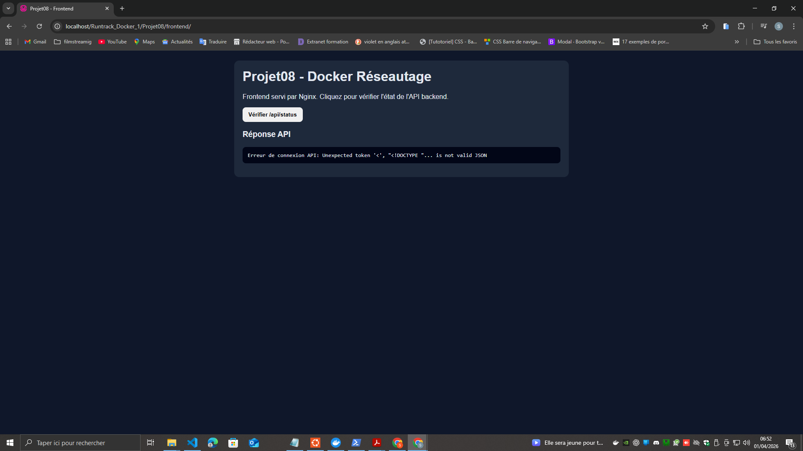
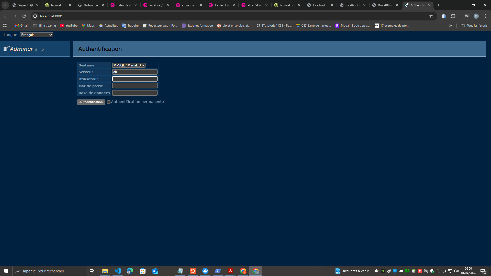
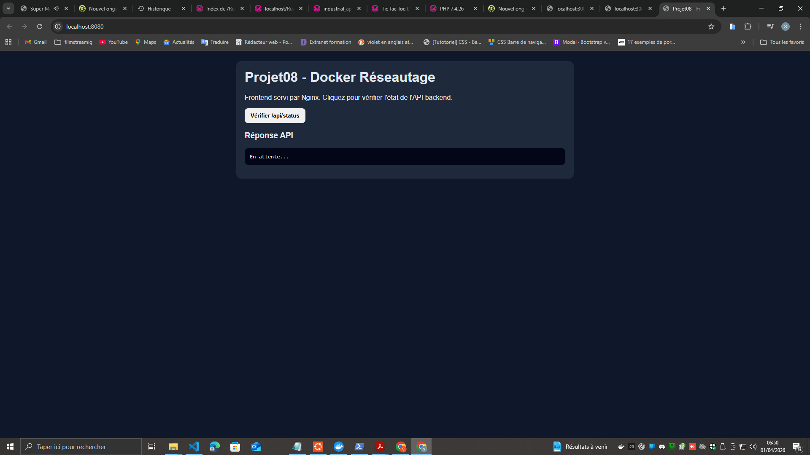
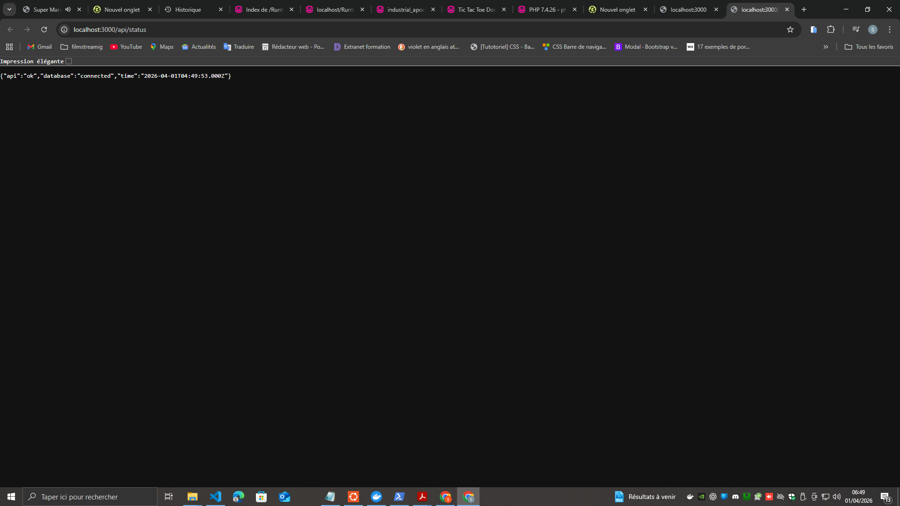
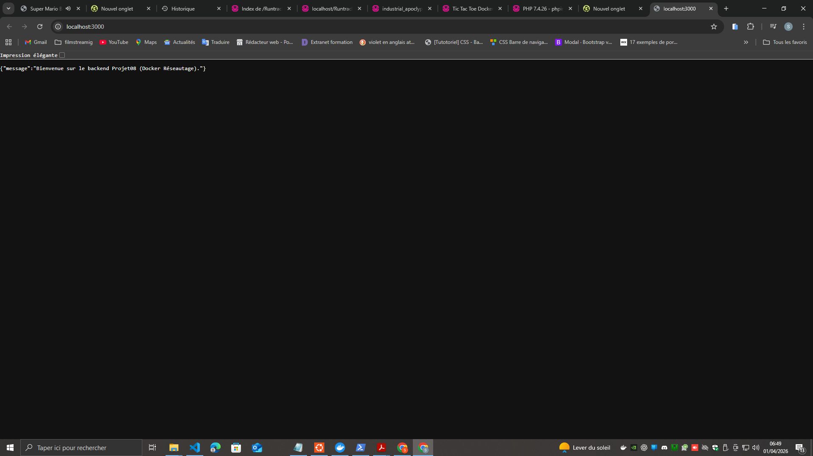

# Projet08 - Docker Réseautage (Application multi-conteneurs)

## Objectif
Déployer une application web composée de 4 services Docker :
- `database` : MySQL 8
- `backend` : Node.js 16-alpine (`express` + `mysql2`)
- `nginx` : frontend Nginx alpine
- `adminer` : interface d'administration BDD

---

## Arborescence du projet
- [Projet08/docker-compose.yml](docker-compose.yml)
- [Projet08/backend/Dockerfile](backend/Dockerfile)
- [Projet08/backend/server.js](backend/server.js)
- [Projet08/backend/package.json](backend/package.json)
- [Projet08/frontend/index.html](frontend/index.html)
- [Projet08/nginx/nginx.conf](nginx/nginx.conf)
- [Projet08/images](images)

---

## 1) Lancer l'application complète

```bash
docker compose up -d --build
```

Vérification des services :

```bash
docker compose ps
```

Sortie observée :

```text
projet08-adminer    Up ...   0.0.0.0:8081->8080/tcp
projet08-backend    Up ...   0.0.0.0:3000->3000/tcp
projet08-database   Up ...   3306/tcp, 33060/tcp
projet08-nginx      Up ...   0.0.0.0:8080->80/tcp
```

---

## 2) Vérifier la connectivité entre services

### Backend
- http://localhost:3000/

Réponse :

```json
{
  "message": "Bienvenue sur le backend Projet08 (Docker Réseautage)."
}
```

### API status (backend ↔ MySQL)
- http://localhost:3000/api/status

Réponse :

```json
{
  "api": "ok",
  "database": "connected",
  "time": "2026-04-01T04:47:39.000Z"
}
```

### Frontend (Nginx)
- http://localhost:8080
- Résultat : HTTP 200 OK

### Adminer
- http://localhost:8081
- Résultat : HTTP 200 OK

Identifiants Adminer :
- Serveur : `database`
- Utilisateur : `root`
- Mot de passe : `root`
- Base : `projetdb`

---

## 3) Accès MySQL et commandes shell

### Test URL MySQL depuis navigateur
- URL testée : http://localhost:3306
- Résultat : erreur protocole (normal, MySQL n'est pas un service HTTP)

### Entrer dans MySQL depuis le terminal

```bash
docker exec -it projet08-database mysql -uroot -proot
```

Afficher les bases :

```sql
SHOW DATABASES;
```

Quitter le shell MySQL :

```sql
exit;
```

Commande non-interactive utile :

```bash
docker exec projet08-database mysql -uroot -proot -e "SHOW DATABASES;"
```

---

## 4) Réseau et volumes

- Réseau créé par Compose : `projet08_appnet`
- Volume persistant MySQL : `projet08_db_data`

Commandes de vérification :

```bash
docker network ls
docker volume ls
```

---

## 5) Arrêter l'environnement

```bash
docker compose down
```

---

## Captures réalisées

### Frontend ouvert directement depuis les fichiers


### Frontend via Nginx sur le port 8080


### Connexion Adminer


### Route backend `/`


### Route backend `/api/status`

