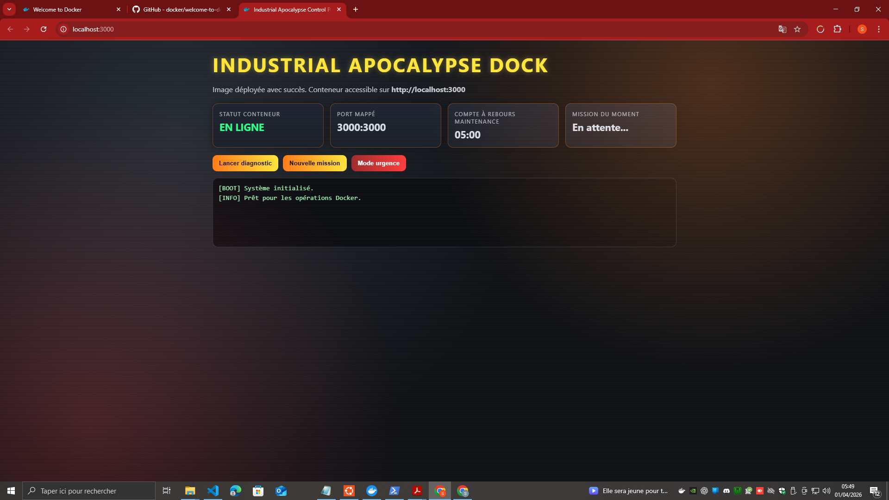

# WELCOME_BACK_DOCKER — README Global

> Parcours d'apprentissage Docker & Symfony en 9 projets + 1 projet bonus, du premier conteneur à une application web complète avec authentification.

---

## Sommaire

| Projet | Thème | Technologies | Port(s) |
|--------|-------|-------------|---------|
| [Projet01](#projet01--premiers-pas-avec-docker) | Premiers pas Docker (4 jobs) | Docker CLI | — |
| [Projet02](#projet02--commandes-docker-de-base) | Commandes Docker de base | Docker CLI | 3000 |
| [Projet03](#projet03--build-dune-image-react) | Build image React personnalisée | Node 22, React 18, serve | 8088 |
| [Projet04](#projet04--mario-multi-conteneurs) | Jeu Mario multi-instances | Docker Desktop | 8600, 8700 |
| [Projet05](#projet05--apache--php-phpinfo) | Serveur Apache + PHP | PHP 8.2-apache | 8080 |
| [Projet06](#projet06--serveur-express-port-mapping) | Express + port mapping | Node 20, Express | 3000 |
| [Projet07](#projet07--tic-tac-toe--volumes-docker) | Tic Tac Toe + volume persistant | Nginx + PHP-FPM, Debian | 8080 |
| [Projet08](#projet08--application-multi-conteneurs) | Multi-conteneurs Docker Compose | Node 16, MySQL 8, Nginx, Adminer | 8080, 3000, 8081 |
| [Projet09](#projet09--dossier-vide) | (en cours) | — | — |
| [UNIT_SYMFONY](#unit_symfony--application-symfony-avec-authentification) | Symfony 7 + auth RBAC | PHP 8.2-FPM, Symfony, MySQL 8, Nginx | 8090, 8091, 8082 |

---

## Projet01 — Premiers pas avec Docker

**Dossier :** [Projet01/](Projet01/)

Quatre exercices progressifs pour découvrir Docker depuis zéro.

### Job01 — Premier conteneur
```bash
docker run hello-world
```
> Lance le conteneur `hello-world` : Docker cherche l'image localement, la télécharge si absente, puis exécute le conteneur.

**Concept clé :** le daemon Docker (processus invisible, autonome, réactif).

📄 [Projet01/job01/README.md](Projet01/job01/README.md)

---

### Job02 — Déployer le jeu Mario
```bash
docker search mario
docker pull sevenajay/mario:latest
docker run -d -p 4545:80 sevenajay/mario:latest
# → http://localhost:4545
```


📄 [Projet01/job02/README.md](Projet01/job02/README.md)

---

### Job03 — Commandes de monitoring
```bash
docker ps        # conteneurs actifs
docker ps -a     # tous les conteneurs
docker images    # images locales
docker network ls  # réseaux Docker
```
📄 [Projet01/job03/README.md](Projet01/job03/README.md)

---

### Job04 — Exercice Nginx
```bash
docker run -d -p 8080:80 nginx
docker exec <ID> ls /usr/share/nginx/html   # → 50x.html, index.html
docker stop <ID> && docker rm <ID>
```
📄 [Projet01/job04/README.md](Projet01/job04/README.md)

---

## Projet02 — Commandes Docker de base

**Dossier :** [Projet02/](Projet02/)

Maîtriser les commandes essentielles : `pull`, `run`, `ps`, `stop`, `rm`, `prune`.

```bash
docker pull docker/welcome-to-docker
docker run -d --rm -p 3000:80 docker/welcome-to-docker
# → http://localhost:3000
```


📄 [Projet02/README.md](Projet02/README.md)

---

## Projet03 — Build d'une image React

**Dossier :** [Projet03/](Projet03/)

Construire une image Docker depuis le code source d'une application React (clone du projet `docker/welcome-to-docker`), la publier sur Docker Hub.

**Fichiers clés :**
| Fichier | Rôle |
|---------|------|
| [Projet03/Dockerfile](Projet03/Dockerfile) | Build multi-étapes : install → build → serve |
| [Projet03/src/App.js](Projet03/src/App.js) | Composant React principal avec liens de partage social |
| [Projet03/src/Confetti.js](Projet03/src/Confetti.js) | Animation de confettis tsparticles |
| [Projet03/src/index.js](Projet03/src/index.js) | Point d'entrée React 18 |

```bash
docker build -t my-welcome-to-docker .
docker run -d -p 8088:3000 --name welcome-container my-welcome-to-docker
# → http://localhost:8088
```

📄 [Projet03/README.md](Projet03/README.md) | [Projet03/PROJET03_README.md](Projet03/PROJET03_README.md)

---

## Projet04 — Mario multi-conteneurs

**Dossier :** [Projet04/](Projet04/)

Lancer deux instances du jeu Mario en parallèle sur des ports différents, via terminal et Docker Desktop.

```bash
docker run -d -p 8600:8080 --name mario-game-1 sevenajay/mario:latest
docker run -d -p 8700:8080 --name mario-game-2 sevenajay/mario:latest
```


📄 [Projet04/README.md](Projet04/README.md)

---

## Projet05 — Apache + PHP (phpinfo)

**Dossier :** [Projet05/](Projet05/)

Créer une image Docker Apache/PHP, afficher `phpinfo()`, mapper les ports.

**Fichiers clés :**
| Fichier | Rôle |
|---------|------|
| [Projet05/Dockerfile](Projet05/Dockerfile) | Image `php:8.2-apache` + copie de `index.php` |
| [Projet05/index.php](Projet05/index.php) | Appel `phpinfo()` |

```bash
docker build -t projet05-phpinfo .
docker run -d -p 8080:80 --name projet05-apache projet05-phpinfo
# → http://localhost:8080
```


📄 [Projet05/README.md](Projet05/README.md)

---

## Projet06 — Serveur Express + Port Mapping

**Dossier :** [Projet06/](Projet06/)

Application Node.js/Express avec une interface "Industrial Apocalypse" thématisée. Démontre le port mapping, les API REST intégrées et le démarrage sous utilisateur non-root.

**Fichiers clés :**
| Fichier | Rôle |
|---------|------|
| [Projet06/Dockerfile](Projet06/Dockerfile) | Image Node 20-slim, utilisateur nextjs, production |
| [Projet06/server.js](Projet06/server.js) | Serveur Express : routes `/`, `/api/health`, `/api/mission` |

```bash
docker build -t apocalypse-industrial:1.0 .
docker run -d --name projet06-apocalypse -p 3000:3000 apocalypse-industrial:1.0
# → http://localhost:3000
```




📄 [Projet06/README.md](Projet06/README.md)

---

## Projet07 — Tic Tac Toe + Volumes Docker

**Dossier :** [Projet07/](Projet07/)

Jeu Tic Tac Toe complet hébergé dans Docker. Les résultats de chaque partie sont sauvegardés dans un **volume nommé** `game-results` via un script PHP.

**Architecture :**
```
Nginx (port 80) → sert index.html + proxy PHP
PHP-FPM         → exécute save.php (écrit results.json)
Volume Docker   → game-results → persistance entre redémarrages
```

**Fichiers clés :**
| Fichier | Rôle |
|---------|------|
| [Projet07/Dockerfile](Projet07/Dockerfile) | Debian slim + Nginx + PHP-FPM |
| [Projet07/default.conf](Projet07/default.conf) | Config Nginx avec FastCGI vers PHP-FPM |
| [Projet07/index.html](Projet07/index.html) | Jeu Tic Tac Toe en vanilla JS |
| [Projet07/save.php](Projet07/save.php) | API PHP : lit/écrit results.json |

```bash
docker build -t projet07-tictactoe:1.0 .
docker volume create game-results
docker run -d --name projet07-tictactoe -p 8080:80 -v game-results:/usr/share/nginx/html projet07-tictactoe:1.0
# → http://localhost:8080
```


📄 [Projet07/README.md](Projet07/README.md)

---

## Projet08 — Application Multi-conteneurs

**Dossier :** [Projet08/](Projet08/)

Application web complète orchestrée avec **Docker Compose** : 4 services communiquant sur un réseau bridge interne.

**Architecture :**
```
Browser
  └─► Nginx :8080  (frontend statique + reverse proxy)
        └─► Backend Node.js :3000  (API Express)
              └─► MySQL 8 :3306  (base de données, port interne)
  └─► Adminer :8081  (interface admin BDD)
```

**Fichiers clés :**
| Fichier | Rôle |
|---------|------|
| [Projet08/docker-compose.yml](Projet08/docker-compose.yml) | Orchestration des 4 services |
| [Projet08/backend/server.js](Projet08/backend/server.js) | API Node.js : `/` et `/api/status` (test connexion MySQL) |
| [Projet08/nginx/nginx.conf](Projet08/nginx/nginx.conf) | Proxy `/api/` → backend, sert le frontend |
| [Projet08/frontend/index.html](Projet08/frontend/index.html) | Page HTML avec appel AJAX à l'API |

```bash
docker compose up -d --build
# Frontend  → http://localhost:8080
# Backend   → http://localhost:3000
# Adminer   → http://localhost:8081  (server=database, user=root, pass=root, db=projetdb)
docker compose down
```


📄 [Projet08/README.md](Projet08/README.md)

---

## Projet09 — (Dossier vide)

**Dossier :** [Projet09/](Projet09/)

Projet en attente de contenu.

---

## UNIT_SYMFONY — Application Symfony avec Authentification

**Dossier :** [UNIT_SYMFONY/](UNIT_SYMFONY/)

Application **Symfony 7** complète avec :
- Authentification RBAC (2 rôles : `ROLE_ADMIN` / `ROLE_USER`)
- Deux formulaires de connexion séparés
- Persistance MySQL via Doctrine ORM
- Migrations de base de données
- 5 services Docker orchestrés

**Architecture Docker :**
```
Browser
  └─► Nginx :8090           (reverse proxy FastCGI)
        └─► PHP-FPM :9000   (Symfony application)
              └─► MySQL :3306  (base Symfony, port interne)
  └─► phpMyAdmin :8091
  └─► Adminer :8082
```

**Fichiers clés :**
| Fichier | Rôle |
|---------|------|
| [UNIT_SYMFONY/docker-compose.yml](UNIT_SYMFONY/docker-compose.yml) | 5 services : app, nginx, db, phpmyadmin, adminer |
| [UNIT_SYMFONY/Dockerfile](UNIT_SYMFONY/Dockerfile) | PHP 8.2-FPM + extensions Symfony |
| [UNIT_SYMFONY/nginx/default.conf](UNIT_SYMFONY/nginx/default.conf) | Front Controller Symfony via FastCGI |
| [UNIT_SYMFONY/app/src/Entity/User.php](UNIT_SYMFONY/app/src/Entity/User.php) | Entité User avec rôles JSON |
| [UNIT_SYMFONY/app/src/Security/LoginFormAuthenticator.php](UNIT_SYMFONY/app/src/Security/LoginFormAuthenticator.php) | Authentificateur CSRF + RBAC |
| [UNIT_SYMFONY/app/src/Command/BootstrapUsersCommand.php](UNIT_SYMFONY/app/src/Command/BootstrapUsersCommand.php) | Commande d'initialisation des comptes |

**URLs de l'application :**
| URL | Description |
|-----|-------------|
| http://localhost:8090/ | Page d'accueil |
| http://localhost:8090/login/admin | Connexion administrateur |
| http://localhost:8090/login/user | Connexion utilisateur |
| http://localhost:8090/admin | Tableau de bord admin (ROLE_ADMIN requis) |
| http://localhost:8090/user | Tableau de bord utilisateur (ROLE_USER requis) |
| http://localhost:8091 | phpMyAdmin |
| http://localhost:8082 | Adminer |

**Comptes de démonstration :**
| Email | Mot de passe | Rôle |
|-------|-------------|------|
| admin@unit.local | Admin1234! | ROLE_ADMIN |
| user@unit.local | User1234! | ROLE_USER |

```bash
docker compose up -d --build
docker exec -it Symfony_app bash
composer install
php bin/console doctrine:migrations:migrate
php bin/console app:bootstrap-users
```

### Maquettes de l'interface (exemples SVG)


📄 [UNIT_SYMFONY/README.md](UNIT_SYMFONY/README.md)

---

## Synthèse des compétences acquises

| Compétence | Projets concernés |
|------------|------------------|
| Commandes Docker de base (`pull`, `run`, `ps`, `stop`, `rm`) | P01, P02 |
| Port mapping (`-p hôte:conteneur`) | P01-J02, P02, P03, P04, P05, P06 |
| Build d'image depuis Dockerfile | P03, P05, P06, P07 |
| Sécurité conteneur (utilisateur non-root) | P06 |
| Volumes nommés (persistance de données) | P07 |
| Multi-conteneurs avec Docker Compose | P08, UNIT_SYMFONY |
| Réseau bridge interne Docker | P08, UNIT_SYMFONY |
| Reverse proxy Nginx → FastCGI/Node.js | P07, P08, UNIT_SYMFONY |
| PHP-FPM avec Nginx | P07, UNIT_SYMFONY |
| Symfony 7 + Doctrine ORM + Migrations | UNIT_SYMFONY |
| Authentification RBAC + CSRF (Symfony Security) | UNIT_SYMFONY |
| Multi-arch Docker build (linux/amd64, linux/arm64) | P03 (MAINTAINERS) |

---

## Structure globale du dépôt

```
WELCOME_BACK_DOCKER/
├── README.md                    ← ce fichier
├── Projet01/
│   ├── job01/README.md          ← hello-world
│   ├── job02/README.md          ← Mario + mario_screenshot.png
│   ├── job03/README.md          ← monitoring
│   └── job04/README.md          ← Nginx
├── Projet02/README.md           ← welcome-to-docker + images/
├── Projet03/                    ← React app + Dockerfile
│   ├── src/{App,Confetti,index}.js
│   └── public/index.html
├── Projet04/README.md           ← Mario multi-instances + images/
├── Projet05/                    ← PHP phpinfo + images/
├── Projet06/                    ← Express Industrial Apocalypse + images/
├── Projet07/                    ← Tic Tac Toe + volume + images/
├── Projet08/                    ← Docker Compose multi-services + images/
│   ├── backend/
│   ├── frontend/
│   └── nginx/
├── Projet09/                    ← (vide)
└── UNIT_SYMFONY/                ← Symfony 7 + auth RBAC
    ├── app/src/
    ├── nginx/
    └── Screenshot/examples/
```